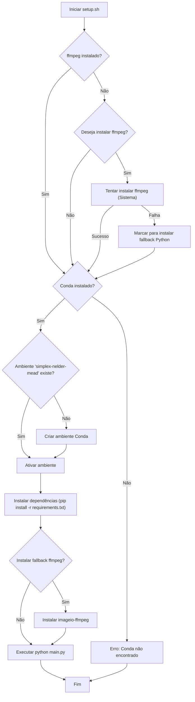
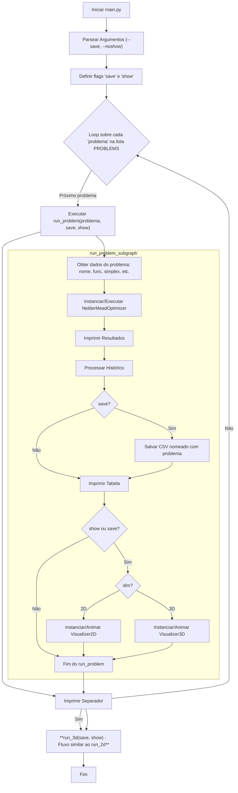

# Implementação do Método Simplex de Nelder-Mead com Visualização

Este projeto oferece uma implementação em Python do algoritmo de otimização Nelder-Mead, juntamente com ferramentas para visualizar a evolução do simplex em 2D e 3D usando Matplotlib. Ele inclui demonstrações pré-configuradas e opções para salvar as animações e o histórico de otimização.

## Funcionalidades

*   **Algoritmo Nelder-Mead Genérico:** Implementado na classe `NelderMeadOptimizer`, funciona para funções objetivo de qualquer dimensão (N).
*   **Visualização 2D e 3D:** Classes `SimplexVisualizer2D` e `SimplexVisualizer3D` para gerar animações da busca pelo ótimo sobre curvas de nível (2D) ou no espaço (3D).
*   **Exportação de Animações:** Capacidade de salvar as animações geradas como arquivos `.mp4` (requer `ffmpeg`).
*   **Exportação de Histórico:** O histórico dos melhores pontos encontrados a cada iteração pode ser salvo em arquivos `.csv`.
*   **Demonstrações:** Script `main.py` com exemplos de uso para a função de Booth (2D) e a função Esfera (3D).
*   **Script de Configuração:** `setup.sh` para automatizar a criação do ambiente Conda, instalação de dependências e execução inicial.
*   **Código Comentado:** Comentários e docstrings em português para facilitar o entendimento.
*   **Saída Organizada:** O script principal (`main.py`) imprime informações formatadas sobre a execução, incluindo tabelas do histórico.

## Estrutura do Projeto

```
metodo-simplex-nelder-mead/
├── nelder_mead.py       # Módulo principal com as classes do otimizador e visualizadores
├── main.py              # Script para executar a lista de problemas pré-definidos
├── setup.sh             # Script Bash para configuração do ambiente e execução
├── requirements.txt     # Lista de dependências Python
├── README.md            # Este arquivo
├── 2d/                  # Diretório para outputs das execuções 2D
│   ├── Booth_2D.mp4
│   ├── Booth_2D_history.csv
│   ├── Rosenbrock_2D.mp4
│   ├── Rosenbrock_2D_history.csv
│   ├── Himmelblau_2D.mp4
│   └── Himmelblau_2D_history.csv
└── 3d/                  # Diretório para outputs das execuções 3D
    ├── Sphere_3D.mp4
    ├── Sphere_3D_history.csv
    ├── Shifted_Sphere_3D.mp4
    ├── Shifted_Sphere_3D_history.csv
    ├── Paraboloid_3D.mp4
    └── Paraboloid_3D_history.csv
```

## Configuração e Instalação

O script `setup.sh` automatiza o processo. Pré-requisitos:

*   Um ambiente Bash (Linux, macOS, WSL no Windows).
*   Gerenciador de pacotes Conda (Miniconda ou Anaconda) instalado e no PATH.

**Para configurar:**

1.  Abra um terminal no diretório `metodo-simplex-nelder-mead`.
2.  Dê permissão de execução ao script: `chmod +x setup.sh`
3.  Execute o script: `./setup.sh`

O script fará o seguinte:

1.  Verificará se o `ffmpeg` está instalado (necessário para salvar vídeos). Se não estiver, perguntará se você deseja tentar instalá-lo.
2.  Verificará se o Conda está disponível.
3.  Criará um novo ambiente Conda chamado `simplex-nelder-mead` com Python 3.12 (se ainda não existir).
4.  Ativará o ambiente Conda.
5.  Instalará as dependências Python listadas em `requirements.txt` usando `pip`.
6.  Se a instalação do `ffmpeg` foi solicitada e falhou via gerenciador de pacotes, tentará instalar um fallback via `pip` (`imageio-ffmpeg`).
7.  Executará o script `main.py` pela primeira vez.

## Executando as Demonstrações

Após a configuração inicial com `setup.sh`, você pode executar as demonstrações manualmente:

1.  **Ative o ambiente Conda:**
    ```bash
    conda activate simplex-nelder-mead
    ```
2.  **Execute o script `main.py`:**
    ```bash
    python main.py [opções]
    ```

**Opções do `main.py`:**

*   **(Nenhuma):** Executa as demonstrações 2D e 3D e exibe as janelas de animação interativamente. O histórico é exibido como tabela no console.
*   `--save`: Além de executar e exibir as tabelas, salva as animações como `booth2d.mp4` e `sphere3d.mp4`, e o histórico como `booth2d_history.csv` e `sphere3d_history.csv`. *Requer `ffmpeg` instalado.* As janelas interativas ainda são exibidas por padrão.
*   `--noshow`: Executa as demonstrações e imprime as tabelas, mas *não* exibe as janelas de animação interativas do Matplotlib. Útil para rodar o script de forma não interativa (ex: em servidores) ou apenas para gerar os arquivos de saída com `--save`.
*   `--save --noshow`: Executa, imprime tabelas, salva os arquivos `.mp4` e `.csv`, mas não mostra nenhuma janela interativa.

**Exemplos:**

```bash
# Executar e mostrar animações interativas
python3 main.py

# Executar, salvar vídeos/CSVs e mostrar animações
python3 main.py --save

# Executar, salvar vídeos/CSVs, mas NÃO mostrar animações
python3 main.py --save --noshow

# Executar sem salvar e sem mostrar animações (apenas imprime tabelas)
python main.py --noshow
```

## Entendendo os Scripts

### `setup.sh`

Este script orquestra a preparação do ambiente.



### `nelder_mead.py`

Este é o coração do projeto, contendo a lógica do algoritmo e da visualização.

*   **`NelderMeadOptimizer`**: Implementa o algoritmo Nelder-Mead.
*   **`SimplexVisualizer2D`**: Gera animações 2D.
*   **`SimplexVisualizer3D`**: Gera animações 3D.

(As descrições detalhadas das classes foram mantidas como antes)

### `main.py`

Este script serve como **orquestrador principal**, definindo e executando uma lista de problemas de otimização usando as ferramentas do `nelder_mead.py`.

**Principais Componentes:**

1.  **Definição de Funções-Objetivo:** Contém as implementações das funções matemáticas que serão otimizadas nos exemplos (ex: `booth`, `sphere3d`, `rosenbrock`, `shifted_sphere3d`). Você pode adicionar suas próprias funções aqui.
2.  **Lista `PROBLEMS`:** O coração da configuração. É uma lista Python onde cada elemento é um dicionário que descreve um problema específico a ser resolvido. Veja a seção "Adicionando Novos Problemas" abaixo para detalhes sobre como configurar cada dicionário.
3.  **Função `run_problem`:** Uma função auxiliar que recebe um dicionário de problema (da lista `PROBLEMS`) e as flags `save`/`show` da linha de comando. Esta função realiza todo o trabalho para aquele problema específico:
    *   Extrai os dados (nome, função, simplex inicial, etc.).
    *   Instancia `NelderMeadOptimizer` com os parâmetros corretos.
    *   Chama `optimizer.optimize()`.
    *   Imprime os resultados da otimização (ponto ótimo, valor, iterações).
    *   Processa o `optimizer.history` para gerar a tabela de histórico e os dados para o CSV.
    *   Imprime a tabela no console.
    *   Se `save=True`, salva o histórico em um arquivo `.csv` no diretório `2d/` ou `3d/`, usando o nome do problema.
    *   Se `save=True` ou `show=True`, instancia o visualizador apropriado (`SimplexVisualizer2D` ou `SimplexVisualizer3D`).
    *   Se `save=True`, salva a animação em um arquivo `.mp4` no diretório `2d/` ou `3d/`, usando o nome do problema.
    *   Se `show=True`, exibe a animação interativa.
4.  **Função `main`:**
    *   Configura e parseia os argumentos de linha de comando (`--save`, `--noshow`).
    *   Imprime cabeçalhos e rodapés gerais.
    *   **Itera sobre a lista `PROBLEMS`**, chamando `run_problem` para cada dicionário de problema encontrado.
    *   Imprime separadores entre a execução de cada problema.

**Exemplos de Problemas Incluídos:**

Atualmente, a lista `PROBLEMS` em `main.py` inclui os seguintes exemplos pré-configurados:

*   **`Booth_2D`**: Função de Booth (2D), um vale quadrático com um mínimo global.
*   **`Sphere_3D`**: Função Esfera (3D), uma bacia simples com mínimo na origem.
*   **`Rosenbrock_2D`**: Função de Rosenbrock (2D), um vale curvo e estreito, clássico para testes de otimização.
*   **`Shifted_Sphere_3D`**: Função Esfera (3D) com o mínimo deslocado da origem.
*   **`Himmelblau_2D`**: Função de Himmelblau (2D), conhecida por ter quatro mínimos locais idênticos.
*   **`Paraboloid_3D`**: Função Paraboloide (3D), similar à função esfera, usada aqui com um ponto inicial diferente.



**Adicionando Novos Problemas:**

Para adicionar um novo caso de teste ou problema de otimização, basta editar a lista `PROBLEMS` em `main.py` e adicionar um novo dicionário com as seguintes chaves:

*   `name` (obrigatório, `str`): Um nome curto e único, usado para identificar o problema nos logs e para nomear os arquivos de saída (`<name>.mp4`, `<name>_history.csv`). Evite espaços ou caracteres especiais que sejam inválidos em nomes de arquivo.
*   `func` (obrigatório, `Callable`): A referência à função Python que implementa a função-objetivo a ser minimizada. Esta função deve aceitar um `np.ndarray` como entrada e retornar um `float`.
*   `simplex0` (obrigatório, `np.ndarray`): Um array NumPy definindo os vértices do simplex inicial. Para um problema de dimensão `N`, este deve ser um array de shape `(N+1, N)`.
*   `dim` (obrigatório, `int`): A dimensionalidade do problema (atualmente suporta 2 ou 3 para visualização).
*   `bounds` (obrigatório, `List[Tuple[float, float]]`): Uma lista definindo os limites dos eixos para a visualização. Deve conter `dim` tuplas, cada uma com `(min, max)` para o respectivo eixo (ex: `[(x_min, x_max), (y_min, y_max)]` para 2D).
*   `optimizer_params` (opcional, `Dict`): Um dicionário contendo parâmetros a serem passados para o construtor de `NelderMeadOptimizer`. Se omitido, os valores padrão da classe serão usados. Exemplo: `{"maxIter": 500, "tol": 1e-8}`.
*   `viz_params` (opcional, `Dict`

## Arquivos de Saída

Ao usar a opção `--save`, os seguintes arquivos (nomeados de acordo com o `name` de cada problema definido na lista `PROBLEMS` em `main.py`) podem ser gerados nos diretórios `2d/` e `3d/`:

*   **Animações:**
    *   `2d/<ProblemName>.mp4` (ex: `2d/Booth_2D.mp4`, `2d/Rosenbrock_2D.mp4`, `2d/Himmelblau_2D.mp4`, ...)
    *   `3d/<ProblemName>.mp4` (ex: `3d/Sphere_3D.mp4`, `3d/Shifted_Sphere_3D.mp4`, `3d/Paraboloid_3D.mp4`, ...)
*   **Históricos:**
    *   `2d/<ProblemName>_history.csv` (ex: `2d/Booth_2D_history.csv`, `2d/Rosenbrock_2D_history.csv`, ...)
    *   `3d/<ProblemName>_history.csv` (ex: `3d/Sphere_3D_history.csv`, `3d/Shifted_Sphere_3D_history.csv`, ...)

Se você adicionar novos problemas à lista `PROBLEMS`, os arquivos de saída correspondentes também serão gerados nesses diretórios ao usar `--save`.

## Dependências

**Dependências Python (listadas em `requirements.txt`):**

Estas são as bibliotecas Python necessárias para executar o código. Elas podem ser instaladas usando o script `setup.sh` (que usa `pip` dentro de um ambiente Conda) ou manualmente com `pip`:

```bash
pip install -r requirements.txt
```

*   `numpy`: Para computação numérica e arrays.
*   `matplotlib`: Para plotagem e animação.
*   `tabulate`: Para formatar as tabelas do histórico no console.

**Ferramentas Externas:**

*   **Conda (Miniconda/Anaconda):** Necessário **apenas se você utilizar o script `setup.sh`** para criar e gerenciar automaticamente o ambiente Python recomendado. Se você preferir gerenciar seu ambiente Python manualmente, o Conda não é estritamente necessário (basta ter Python e `pip` para instalar as dependências acima).
*   **ffmpeg (Opcional):** Necessário **apenas se você quiser usar a opção `--save`** para gerar as animações em formato de vídeo (`.mp4`). O script `setup.sh` tenta auxiliar na instalação, mas ele pode ser instalado separadamente usando o gerenciador de pacotes do seu sistema (apt, brew, etc.).
