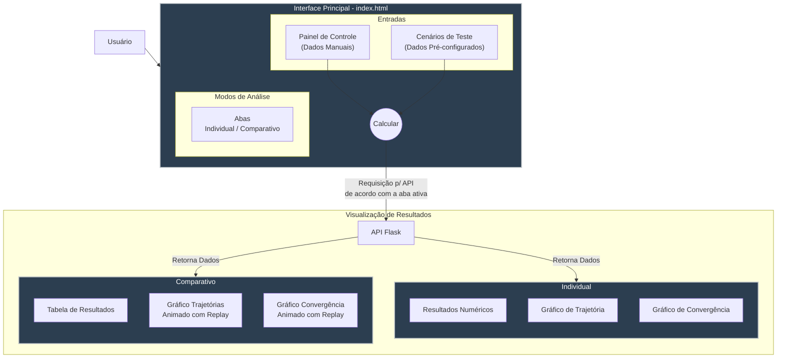

# Otimizador de Tanque

Este projeto é uma aplicação web desenvolvida em Flask para otimizar o design de um tanque cilíndrico, minimizando seu custo de fabricação com base em restrições de volume e dimensões. A aplicação permite ao usuário comparar visualmente a eficiência de diferentes algoritmos de otimização não linear.

## Estrutura do Projeto

O projeto segue uma estrutura baseada no padrão Model-View-Controller (MVC) para organizar o código:

-   **/controllers**: Contém a lógica que conecta a interface do usuário aos modelos de otimização.
-   **/models**: Inclui a definição do problema (função de custo, restrições) e a implementação dos algoritmos de otimização (Steepest Descent, Newton, DFP).
-   **/static**: Armazena os arquivos estáticos (JavaScript, CSS, imagens). O `main.js` é responsável pela interatividade da página, chamadas de API e renderização dos gráficos com Plotly.
-   **/templates**: Contém o template `index.html` que estrutura a página web.
-   `app.py`: O ponto de entrada da aplicação Flask, que define as rotas da API.
-   `requirements.txt`: Lista as dependências do Python.
## Arquitetura da Interface (Frontend)

O fluxograma abaixo descreve a arquitetura da interface do usuário e o fluxo de interação, desde a entrada de dados até a visualização dos resultados.


## Como Executar

1.  **Crie um Ambiente Virtual**

    É uma boa prática usar um ambiente virtual para isolar as dependências do projeto.

    ```bash
    python -m venv venv
    ```

2.  **Ative o Ambiente Virtual**

    -   No Linux/macOS:
        ```bash
        source venv/bin/activate
        ```
    -   No Windows:
        ```bash
        .\\venv\\Scripts\\activate
        ```

3.  **Instale as Dependências**

    Com o ambiente ativado, instale as bibliotecas necessárias:

    ```bash
    pip install -r requirements.txt
    ```

4.  **Execute a Aplicação**

    Navegue até o diretório `optimzed_tank` e execute o servidor Flask:

    ```bash
    cd optimzed_tank
    flask run
    ```

    A aplicação estará disponível em `http://127.0.0.1:5000` no seu navegador.

